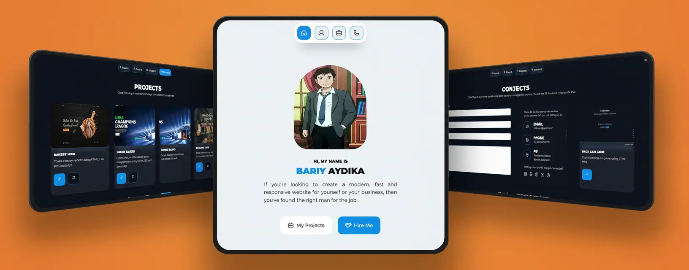

# Personal Portfolio Website

A **responsive personal portfolio website** built with **HTML, CSS and JavaScript**.  
This project is designed to showcase personal details, skills, experiences, and projects in a professional and modern way.

---

## 📖 Description

The Personal Portfolio Website is a **multi-page responsive web application** consisting of:

- **Index/Home Page** – Introduction, profile, and call-to-action.
- **About Page** – Personal background, education, experience, and hobbies.
- **Projects Page** – Showcase of recent projects with links to live demos and GitHub repositories.
- **Contact Page** – A contact form and social media links for easy communication.

The website supports both **light and dark themes**, which are remembered across sessions using `localStorage`.

---

## ⚙️ Requirements

- A modern browser (Chrome, Firefox, Edge, Safari).
- No server-side dependencies required (static files).

---

## 📦 Installation

1. Clone the repository:
   ```bash
   git clone https://github.com/YourUsername/personal-portfolio.git
   ```



2. Open the project folder:

   ```bash
   cd Personal-Portfolio-Website
   ```

3. Run locally:
   ```bash
   open index.html
   ```

🗂 Project Structure:

```bash
Personal-Portfolio-Website/
├── assets/           # Images, icons, screenshots
├── index.html
├── about.html
├── projects.html
├── contact.html
├── style.css
├── main.js            # Script for theme toggle etc.
└── README.md          # This file
```

✅ Contribution

- You’re welcome to fork this project and make enhancements. Some ideas:

- Add animations or transitions (scroll, fade, slide)

- Validate and integrate a working backend for contact form

- Add filtering or sorting for projects

- Improve accessibility (ARIA labels, keyboard nav)

- Optimize images, lazy loading, performance improvements

📝 License

This project is open source under the MIT License. You are free to use, modify, and distribute it.

👨‍💻 Author

RaidanRei 🔗 [GitHub Profile](https://github.com/RaidanRei)

If you like this project, feel free to ⭐ star the repository!
